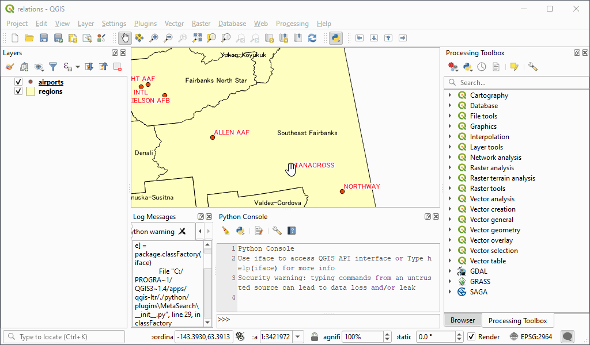

# Hide Docks

This QGIS plugin hides docked panels to expand the map canvas. The dock you want to hide can be selected in the toolbar. Hidden docks can be temporarily unhided by moving the mouse cursor.

